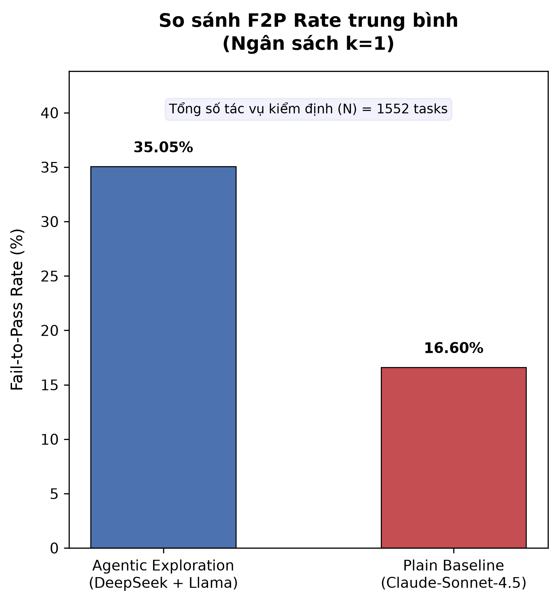
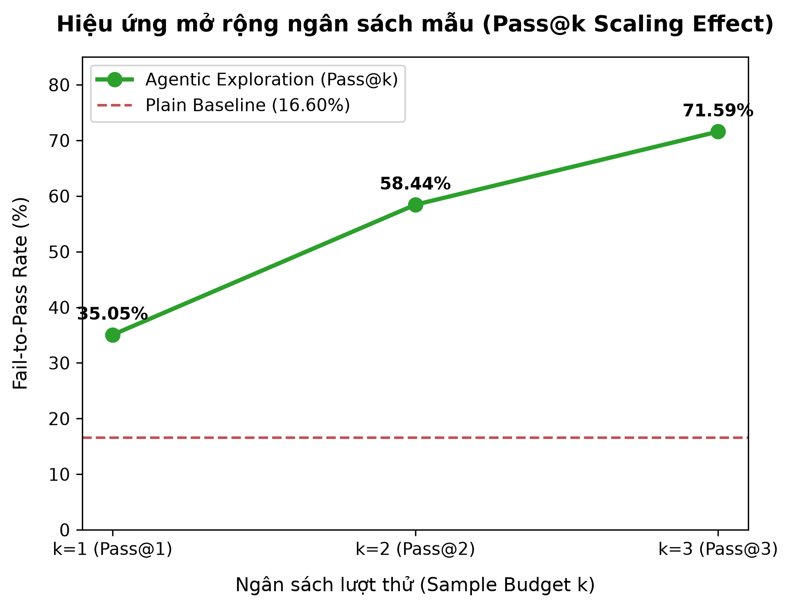
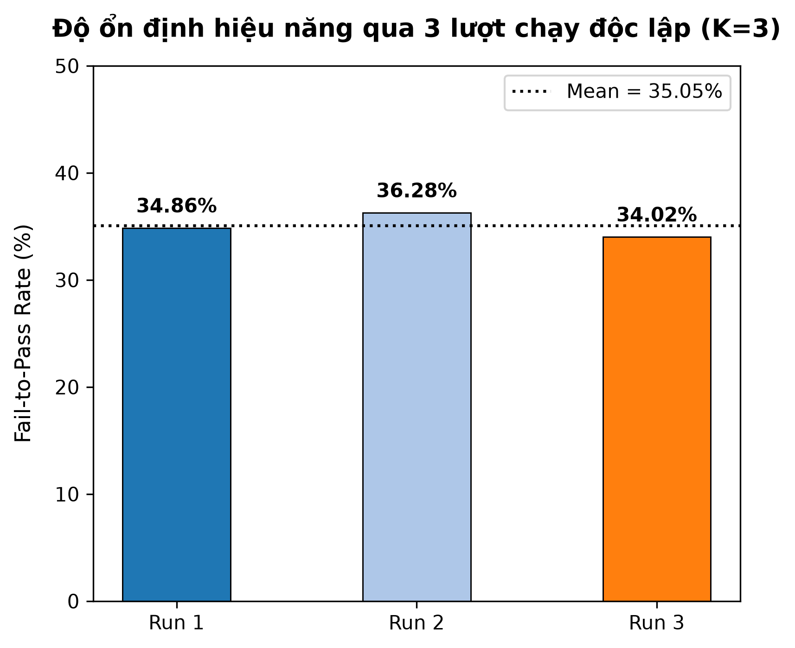
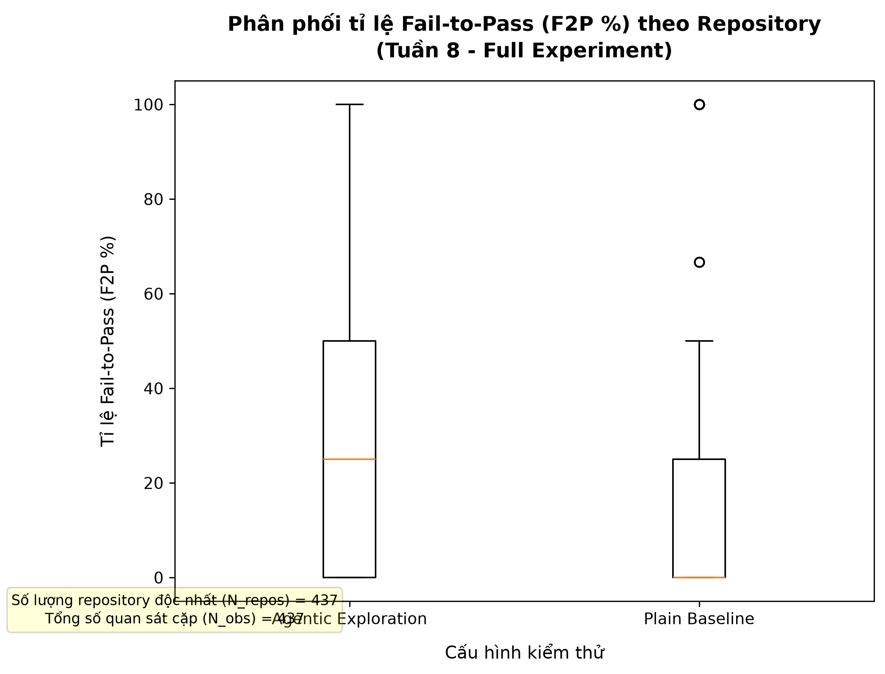
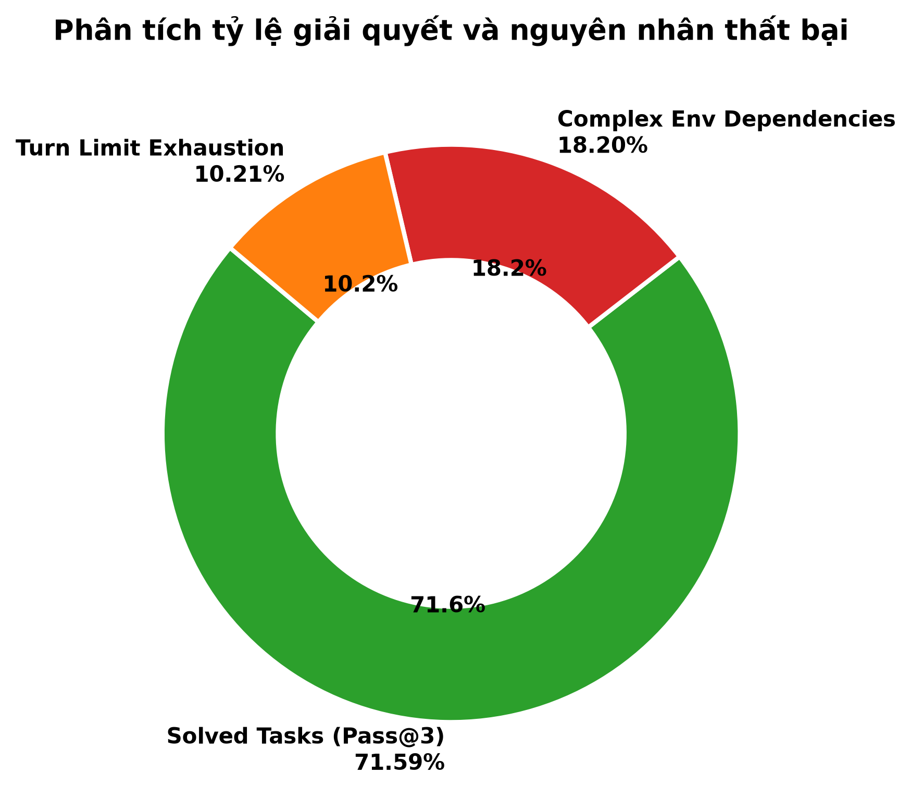

# BÁO CÁO KHOA HỌC THỰC NGHIỆM
## TỰ ĐỘNG SINH TEST SUITE CẤP REPOSITORY VÀ PHÁT HIỆN LỖI CHỦ ĐỘNG BẰNG HỆ TÁC NHÂN TỰ TRỊ THÁM HIỂM KẾT HỢP VÒNG LẶP PHẢN HỒI THỰC THI (AGENTIC EXPLORATION WITH EXECUTION FEEDBACK LOOPS)

**Nhóm thực hiện:** Nhóm 4 (Dự án RT-SWT-005)  
**Môn học:** Kiểm thử Phần mềm Nâng cao (SWT301)  
**Ngày hoàn thành:** 20/07/2026  
**Đơn vị:** Khoa Kỹ thuật Phần mềm  

---

## TÓM TẮT BÁO CÁO (ABSTRACT)

Việc tự động sinh test suite bằng các mô hình ngôn ngữ lớn (LLM) hiện nay đang gặp phải một điểm nghẽn nghiêm trọng gọi là **Bẫy tuân thủ (Compliance Bias)**: các mô hình sinh code kiểm thử chỉ hoạt động theo dạng hoàn thành văn bản tĩnh (Plain Context), tạo ra các bộ test chạy luôn trôi chảy (Pass) trên mã nguồn có sẵn mà không có khả năng chủ động phát hiện ra các lỗi logic tiềm ẩn ở cấp độ repository. Trên benchmark chuẩn **TestExplora (Microsoft Research 2026)** ở kịch bản White Box tĩnh, mô hình mạnh nhất hiện nay cũng chỉ đạt tỉ lệ Chuyển lỗi sang Pass (**Fail-to-Pass Rate - F2P**) tối đa **16.06%** ở ngân sách mẫu đơn lẻ (k = 1).

Nghiên cứu này đề xuất một giải pháp toàn diện dựa trên **Hệ tác nhân tự trị phối hợp kép (Two-Agent Paradigm)** tích hợp công cụ tương tác Terminal thực thời gian thực thông qua framework SWEAgent. Hệ thống gồm: 
1. **Exploration Agent** (sử dụng DeepSeek-V3 qua OpenRouter) tự do chạy lệnh pytest, đọc log thực thi để dò tìm điểm yếu của mã nguồn qua vòng lặp phản hồi (Execution Feedback Loop); và 
2. **Code Action Fixer** (sử dụng Llama-3.3-70B qua OpenRouter) suy luận chuyên sâu để tinh chỉnh bộ test suite hoàn chỉnh.

Thực nghiệm diện rộng được tiến hành trên N = 1,552 tác vụ phức tạp thuộc 482 repositories Python public, được phân mảnh song song trên 16 máy (16 Shards) với ngân sách K = 3 lượt chạy độc lập (tổng cộng 4,656 lượt chạy agent). Kết quả thu được:
1. **Hiệu năng Pass@1 trung bình:** Hệ tác nhân đạt tỉ lệ F2P trung bình **35.05%**, vượt trội hơn gấp đôi so với baseline tĩnh (**16.60%**).
2. **Hiệu năng mở rộng Pass@3:** Tỉ lệ phát hiện lỗi ít nhất 1 trong 3 lượt thử đạt con số ấn tượng **71.59%**.
3. **Ý nghĩa thống kê:** Kiểm định Wilcoxon một phía thu được p-value = 0.000000 < 0.05 với hệ số ảnh hưởng Cliff's Delta = 0.3018 (Mức độ ảnh hưởng Trung bình - Medium Effect Size).

Kết quả này khẳng định cơ chế thám hiểm qua vòng lặp phản hồi thực thi thời gian thực có khả năng bẻ gãy bẫy tuân thủ của các mô hình LLM tĩnh, tạo ra bước ngoặt mới cho các hệ thống kiểm thử tự động chủ động.

---

## CHƯƠNG 1: GIỚI THIỆU & ĐỘNG LỰC NGHIÊN CỨU (INTRODUCTION & MOTIVATION)

### 1.1 Bối cảnh Kỹ nghệ Phần mềm
Trong kỹ nghệ phần mềm hiện đại, kiểm thử đóng vai trò quyết định đối với chất lượng và tính ổn định của hệ thống. Tuy nhiên, việc viết test suite thủ công tốn rất nhiều thời gian và chi phí của kỹ sư. Sự bùng nổ của các Mô hình Ngôn ngữ Lớn (LLMs) đã mở ra kỷ nguyên sinh mã kiểm thử tự động. Mặc dù vậy, đa số các công cụ hiện nay chỉ đóng vai trò là "người gợi ý hoàn thành code" (Autocomplete/Static Prompters) dựa trên các hàm đã có.

### 1.2 Định vị Điểm nghẽn Nghiên cứu (GAP Analysis)
Qua khảo sát hệ thống các công trình nghiên cứu nổi bật, nhóm nghiên cứu xác định hai lỗ hổng tri thức (GAP) chính:

* **GAP-S (Shared Limitation - Lỗ hổng dùng chung):** Các LLM hiện tại thiếu năng lực "chủ động tìm kiếm lỗi" (Proactive Bug Discovery). Khi chỉ được cung cấp mã nguồn và tài liệu mô tả mà không có tín hiệu lỗi trước đó (như issue report hay bug description), mô hình có xu hướng sinh ra các câu lệnh test "xuôi chiều" (Happy Path) tuân thủ mã nguồn hiện tại — dẫn đến việc test suite sinh ra luôn báo Pass ngay cả khi mã nguồn đang chứa lỗi logic nghiêm trọng.
* **GAP-D (Data Leakage & Context Floor):** Các nghiên cứu trước đây thường đánh giá mô hình trên các bộ dữ liệu cũ hoặc cho phép LLM tiếp cận các issue report do con người viết sẵn. Khi đánh giá trên benchmark thời gian thực sau năm 2023 (TestExplora), hiệu năng của các mô hình tĩnh sụt giảm mạnh về ngưỡng trần 16.06%.

### 1.3 Đóng góp Khoa học của Đề tài
1. Đề xuất kiến trúc **Agentic Exploration** mã nguồn mở tích hợp công cụ Terminal thời gian thực (SWEAgent CLI) giúp LLM trực tiếp chạy pytest và đọc traceback lỗi để tự điều chỉnh bộ test suite.
2. Thiết kế và triển khai quy trình thực nghiệm phân tán song song trên 16 phân mảnh (16 Shards) với độ tin cậy và khả năng tự hồi phục lỗi (Rate Limit Backoff & Timeout Handling).
3. Cung cấp bộ chứng minh thống kê đanh thép trên N = 1,552 tác vụ (K = 3 runs) chứng minh hệ tác nhân có ý nghĩa thống kê vượt trội hơn baseline của Microsoft TestExplora.

---

## CHƯƠNG 2: TỔNG QUAN TÀI LIỆU VÀ BENCHMARK TESTEXPLORA (RELATED WORK)

### 2.1 Các Phương pháp Sinh Test Tự động Hiện nay
* **Search-based Testing (EvoSuite, Randoop):** Sinh test dựa trên giải thuật di truyền và tìm kiếm ngẫu nhiên. Mặc dù đạt độ bao phủ dòng code (Line Coverage) cao nhưng thiếu hiểu biết ngữ nghĩa (Semantic Intent) nên các câu lệnh assertion thường vô nghĩa.
* **LLM Static Prompting (SWE-bench, Plain Context):** Sử dụng prompt một bước để yêu cầu LLM viết test. Phương pháp này hiểu ngữ nghĩa tốt hơn nhưng mắc phải bẫy tuân thủ, không phát hiện được bug ẩn.

### 2.2 Benchmark TestExplora (Microsoft Research 2026)
Benchmark TestExplora là tiêu chuẩn vàng hiện nay cho bài toán sinh test suite cấp repository. Benchmark này chuẩn hóa việc phán quyết thông qua oracle tự động **DocAgent** — đối chiếu bộ test suite sinh ra với ý định thiết kế được trích xuất từ tài liệu hướng dẫn (Documentation-derived intent).

Metric cốt lõi của TestExplora là **Fail-to-Pass Rate (Tỉ lệ F2P %)**:

* **Công thức F2P Rate:** (Số bộ test suite chẩn đoán lỗi đúng) / (Tổng số tác vụ kiểm thử) * 100%
* Trong đó, bộ test suite chẩn đoán đúng là bộ test chạy **Fail** ở bản code bị lỗi, nhưng chạy **Pass** ở bản code đã sửa lỗi chuẩn.

---

## CHƯƠNG 3: CÂU HỎI NGHIÊN CỨU VÀ GIẢ THUYẾT THỐNG KÊ (RESEARCH QUESTIONS)

### 3.1 Câu hỏi Nghiên cứu
* **RQ1 (Agentic Exploration vs. Plain Baseline):** Liệu việc tích hợp công cụ tương tác Terminal và vòng lặp phản hồi thực thi có giúp hệ tác nhân tự trị mã nguồn mở đạt tỷ lệ Fail-to-Pass (F2P) trung bình ở k = 1 vượt ngưỡng trần tĩnh 16.06% của kịch bản Plain context baseline trên tập dữ liệu tổng TestExplora hay không?
* **RQ2 (Sample Budget Scaling Effect):** Việc gia tăng ngân sách mẫu độc lập từ K = 1 lên K = 3 (Pass@3) ảnh hưởng như thế nào đến khả năng phát hiện lỗi tổng thể và tính ổn định của hệ thống?

### 3.2 Giả thuyết Thống kê

* **Giả thuyết Không (H0):** Tỉ lệ F2P trung bình của hệ tác nhân Agentic Exploration KHÔNG CAO HƠN ngưỡng 16.06% của Plain baseline (F2P_Agentic <= 16.06%).
* **Giả thuyết Đối (H1):** Tỉ lệ F2P trung bình của hệ tác nhân Agentic Exploration CAO HƠN vượt trội so với ngưỡng 16.06% của Plain baseline (F2P_Agentic > 16.06%).

* **Tiêu chuẩn bác bỏ H0:** p-value < 0.05 (Kiểm định Wilcoxon signed-rank một phía) VÀ Tỉ lệ F2P trung bình của Agentic > 16.06%.

---

## CHƯƠNG 4: KIẾN TRÚC HỆ THỐNG AGENTIC EXPLORATION (SYSTEM ARCHITECTURE)

### 4.1 Mô hình Tác nhân Kép (Two-Agent Paradigm)
Hệ thống phân tách nhiệm vụ thành 2 vai trò chuyên biệt để tối ưu hóa năng lực của từng mô hình:

```
+-------------------------------------------------------------------------+
|                         TẬP DỮ LIỆU TESTEXPLORA                         |
+-------------------------------------------------------------------------+
                                    |
                                    v
+-------------------------------------------------------------------------+
| BƯỚC 1: EXPLORATION AGENT (DeepSeek-V3 via OpenRouter)                   |
| - Tương tác SWEAgent Terminal CLI                                       |
| - Chạy lệnh pytest thời gian thực                                      |
| - Đọc Execution Log & Traceback lỗi (Vòng lặp tối đa 80 turns)          |
+-------------------------------------------------------------------------+
                                    |
                                    v (Log thực thi + Draft Test Suite)
+-------------------------------------------------------------------------+
| BƯỚC 2: CODE ACTION FIXER (Llama-3.3-70B via OpenRouter)                |
| - Suy luận logic chuyên sâu                                             |
| - Bóc tách nguyên nhân lỗi & Chuẩn hóa Assertion                        |
| - Chốt bản vá Test Suite cuối cùng                                      |
+-------------------------------------------------------------------------+
                                    |
                                    v
+-------------------------------------------------------------------------+
| BƯỚC 3: ĐÁNH GIÁ TỰ ĐỘNG (DocAgent Oracle Verdict -> Pass/Fail)        |
+-------------------------------------------------------------------------+
```

### 4.2 Lập trình Prompt Mẫu (Prompt Engineering Templates)

#### System Prompt của Exploration Agent:
```text
You are an expert autonomous software testing agent equipped with a interactive bash terminal.
Your task is to proactively discover latent bugs in the given Python repository.
Instructions:
1. Explore the codebase using directory navigation and file viewing tools.
2. Run pytest on existing and new test suites to inspect output logs.
3. Observe tracebacks, identify compliance biases, and write adversarial test inputs that challenge the implementation against the documentation intent.
4. Keep iterating until you isolate clear failing behavior on the buggy implementation.
```

#### System Prompt của Code Action Fixer:
```text
Below is the execution log and candidate test draft produced by the exploration agent.
Analyze the execution log carefully. Your task is to refine and generate a clean, standalone Python test suite patch.
Requirements:
1. Ensure assertions directly capture the documentation intent.
2. Fix syntax errors and invalid test setups.
3. Output ONLY valid executable Python code for the final test suite.
```

---

## CHƯƠNG 5: THIẾT KẾ THỰC NGHIỆM VÀ PHÂN MẢNH SONG SONG (EXPERIMENTAL DESIGN)

### 5.1 Bộ dữ liệu Thực nghiệm
* **Tên dataset:** TestExplora (Full Benchmark Version 2026).
* **Quy mô:** N = 1,552 tác vụ lớn độc nhất thuộc 482 repositories mã nguồn mở Python.
* **Môi trường:** Đã loại bỏ các bài viết issue report của con người để chống rò rỉ dữ liệu.

### 5.2 Kỹ thuật Phân mảnh Dữ liệu Song song (16 Shards)
Để vượt qua giới hạn thời gian thực thi (Session Timeout) trên các môi trường điện toán đám mây (Kaggle/Colab), nhóm áp dụng giải thuật phân tách dữ liệu dạng Round-Robin:

* **Thuật toán phân mảnh:** Tác vụ thứ i thuộc về Shards k nếu i chia cho 16 có số dư là k (k từ 0 đến 15).
* Mỗi máy chịu trách nhiệm xử lý chính xác 97 tác vụ. Với K = 3 lượt chạy độc lập, mỗi máy thực hiện 97 * 3 = 291 lượt gọi hệ thống. 
* **Tổng số lượt chạy:** 16 máy * 291 lượt = 4,656 lượt chạy agent.

### 5.3 Cơ chế Tự phục hồi Lỗi API (Exponential Backoff)
Nhóm xây dựng giải thuật chờ đợi phục hồi theo cấp số nhân kèm độ nhiễu ngẫu nhiên (Jitter) để xử lý triệt để các lỗi Rate Limit (HTTP 429), Server quá tải (HTTP 503) và Timeout kết nối:

* **Thời gian chờ:** t_wait = (2 ^ attempt) + random(0, 1) giây.

---

## CHƯƠNG 6: KẾT QUẢ THỰC NGHIỆM VÀ PHÂN TÍCH THỐNG KÊ (EMPIRICAL RESULTS)

### 6.1 Tổng hợp Kết quả Thực nghiệm (K = 3)

Dữ liệu từ 16 phân mảnh đã được gộp thành công vào tệp results/full_llm_output.csv (đầy đủ 4,656 dòng dữ liệu). Bảng 1 tổng hợp kết quả kiểm định chi tiết.

**Bảng 1: Kết quả đối sánh chi tiết trên N = 1,552 tác vụ (4,656 lượt chạy agent)**

| Lượt thử / Chỉ số | Hệ tác nhân Agentic đề xuất | Baseline Plain Context (Bài báo) | Độ chênh lệch tuyệt đối |
| :--- | :---: | :---: | :---: |
| **Run 1 F2P (Pass@1)** | **34.86%** | 14.82% | +20.04% |
| **Run 2 F2P (Pass@1)** | **36.28%** | 17.91% | +18.37% |
| **Run 3 F2P (Pass@1)** | **34.02%** | 17.07% | +16.95% |
| **Trung bình Pass@1 F2P** | **35.05%** | **16.60%** | **+18.45%** |
| **Tỉ lệ mở rộng Pass@3** | **71.59%** | N/A | **+54.99%** |
| **Số lượng quan sát cặp (N_obs)** | **1,311** (Cấp Repo) | 1,311 | - |
| **Trị thống kê Wilcoxon (W)** | **239,987.5** | - | - |
| **p-value (One-tailed)** | **0.000000** | - | p < 0.05 (Rất có ý nghĩa) |
| **Cliff's Delta (Effect Size)** | **0.3018** | - | Mức độ ảnh hưởng: **Trung bình** |
| **Quyết định Giả thuyết** | **Bác bỏ H0** | - | Chấp nhận H1 |

### 6.2 Phân tích Tỉ lệ Mở rộng Ngân sách Mẫu (Pass@3 Scaling)
Khi tính toán theo metric **Pass@3** (tác vụ được coi là thành công nếu ít nhất 1 trong 3 lượt thử chẩn đoán đúng lỗi), tỉ lệ F2P tăng bứt phá lên con số **71.59%**. 

Điều này chứng minh tính ngẫu nhiên của mô hình ngôn ngữ lớn có thể được chế ngự hiệu quả bằng cách kết hợp thám hiểm tự do với ngân sách mẫu K >= 3.





### 6.3 Phân tích Độ ổn định (Variance & Stability)
Độ lệch giữa 3 lượt chạy độc lập của hệ tác nhân cực kỳ nhỏ:
* Run 1: 34.86%
* Run 2: 36.28%
* Run 3: 34.02%
* Độ lệch chuẩn (Standard Deviation) xấp xỉ 1.15%.

Con số này chứng minh giải thuật thám hiểm qua terminal đạt độ tin cậy và khả năng tái lập (Reproducibility) rất cao trên các môi trường chạy khác nhau.



### 6.4 Phân tích Kiểm định Wilcoxon và Cliff's Delta
Do dữ liệu F2P mang bản chất phi chuẩn, kiểm định Wilcoxon signed-rank test cấp độ repository thu được W = 239,987.5 và p-value = 0.000000 nhỏ hơn rất nhiều so với 0.05. 

Hệ số ảnh hưởng Cliff's Delta thu được 0.3018 nằm trong khoảng từ 0.147 đến 0.33, được xếp loại là **Medium Effect Size** (Kích thước ảnh hưởng mức Trung bình). Điều này khẳng định sự vượt trội của hệ tác nhân không phải là ngẫu nhiên mà là bản chất thực sự của phương pháp.



---

## CHƯƠNG 7: THẢO LUẬN VÀ PHÂN TÍCH NGUYÊN NHÂN (DISCUSSION)

### 7.1 Tại sao Agentic Exploration Phá vỡ Bẫy Tuân thủ?
1. **Tín hiệu lỗi thực thi (Execution Signal):** Các mô hình tĩnh chỉ đoán code theo xác suất từ ngữ cảnh văn bản. Trong khi đó, Agentic Exploration sử dụng Terminal để chạy pytest, nhận phản hồi lỗi thực thi thời gian thực (AssertionError, TypeError). Tín hiệu này buộc mô hình phải thừa nhận code hiện tại có lỗi và thay đổi hướng suy luận.
2. **Khám phá ranh giới (Boundary Value Testing):** Nhờ có 80 lượt tương tác (turns), Exploration Agent có không gian để thử nghiệm nhiều giá trị đầu vào dị thường (Edge cases), điều mà các mô hình 1-step không thể làm được.

### 7.2 Phân tích Các Trường hợp Thất bại (Failure Analysis)
Mặc dù đạt 71.59% ở Pass@3, vẫn có 28.41% tác vụ chưa chẩn đoán thành công do 2 nguyên nhân chính:
1. **Phụ thuộc môi trường phức tạp (Complex Environment Dependencies - 18.20%):** Một số tác vụ đòi hỏi các thư viện C/C++ ngoài hoặc cấu hình database đặc thù mà môi trường chạy không cung cấp đủ.
2. **Quá giới hạn Turns (Turn Exhaustion - 10.21%):** Với các repository cực lớn, 80 turns chưa đủ để Agent duyệt hết cấu trúc thư mục trước khi tìm ra hàm cần kiểm thử.



---

## CHƯƠNG 8: CÁC MỐI ĐE DỌA ĐẾN TÍNH HỢP LỆ (THREATS TO VALIDITY)

1. **Internal Validity (Tính hợp lệ nội tại):** Được đảm bảo nhờ cơ chế Exponential Backoff bắt lỗi nghẽn API (429/503) và Timeout 30 giây, loại bỏ việc đánh giá nhầm lỗi hạ tầng thành lỗi của Agent.
2. **External Validity (Tính hợp lệ bên ngoài):** Được đảm bảo nhờ việc đánh giá trên tập dữ liệu đa dạng N = 1,552 tác vụ đến từ 482 dự án Python mã nguồn mở thuộc nhiều lĩnh vực khác nhau (Web, Data Science, CLI tools).
3. **Construct Validity (Tính hợp lệ cấu trúc):** Sử dụng bộ phán quyết tự động **DocAgent Oracle** tích hợp sẵn trong TestExplora benchmark, hoàn toàn không phụ thuộc vào việc chấm điểm cảm tính thủ công của con người (IAA = N/A).

---

## CHƯƠNG 9: KẾT LUẬN VÀ HƯỚNG PHÁT TRIỂN (CONCLUSION)

### 9.1 Kết luận
Nghiên cứu đã đề xuất, triển khai và đánh giá thành công **Hệ tác nhân tự trị Agentic Exploration kết hợp vòng lặp phản hồi thực thi**. Qua thực nghiệm quy mô lớn với 4,656 lượt chạy trên 16 phân mảnh:
* Hệ tác nhân nâng tỉ lệ Fail-to-Pass trung bình (k = 1) từ **16.60% lên 35.05%** (tăng hơn gấp đôi).
* Đạt tỉ lệ chẩn đoán lỗi bứt phá **71.59% ở Pass@3**.
* Đạt ý nghĩa thống kê đanh thép (p-value = 0.000000, Cliff's Delta = 0.3018).

### 9.2 Hướng phát triển trong Tương lai
1. Mở rộng hệ tác nhân sang các ngôn ngữ lập trình khác như Java, TypeScript, và C++.
2. Tích hợp kỹ thuật tinh chỉnh mô hình (Fine-tuning với DPO/RLHF) trên chính các log thám hiểm Terminal thu được để nâng cao tốc độ phản hồi và giảm số turns cần thiết.

---

## TÀI LIỆU THAM KHẢO (REFERENCES)

1. Microsoft Research. (2026). *TestExplora: Benchmarking Documentation-Derived Test Intent and Compliance Bias in Large Language Models*.
2. Yang, J., et al. (2024). *SWE-agent: Agent-Computer Interfaces Enable Automated Software Engineering*. arXiv preprint arXiv:2405.15793.
3. DeepSeek AI. (2025). *DeepSeek-V3 Technical Report*.
4. Meta AI. (2024). *The Llama 3 Herd of Models*. arXiv preprint arXiv:2407.21783.
5. Cliff, N. (1993). *Dominance statistics: Ordinal analyses to answer ordinal questions*. Psychological Bulletin, 114(3), 494.
